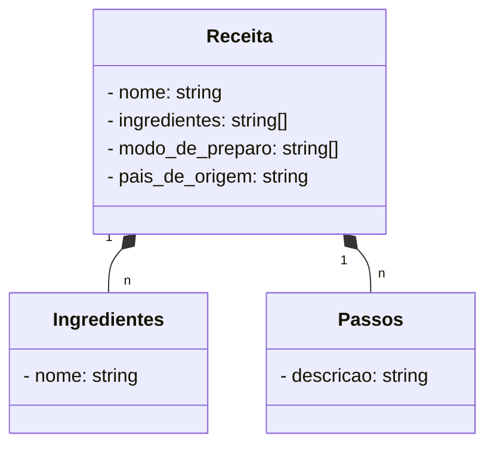

# REST API Receitas

```mermaid
classDiagram
class Receita {
  - nome: string
  - ingredientes: string[]
  - modo_de_preparo: string[]
  - pais_de_origem: string
}
class Ingredientes {
  - nome: string
}

class Passos {
  - descricao: string
}

Receita "1" *-- "n" Ingredientes
Receita "1" *-- "n" Passos
```