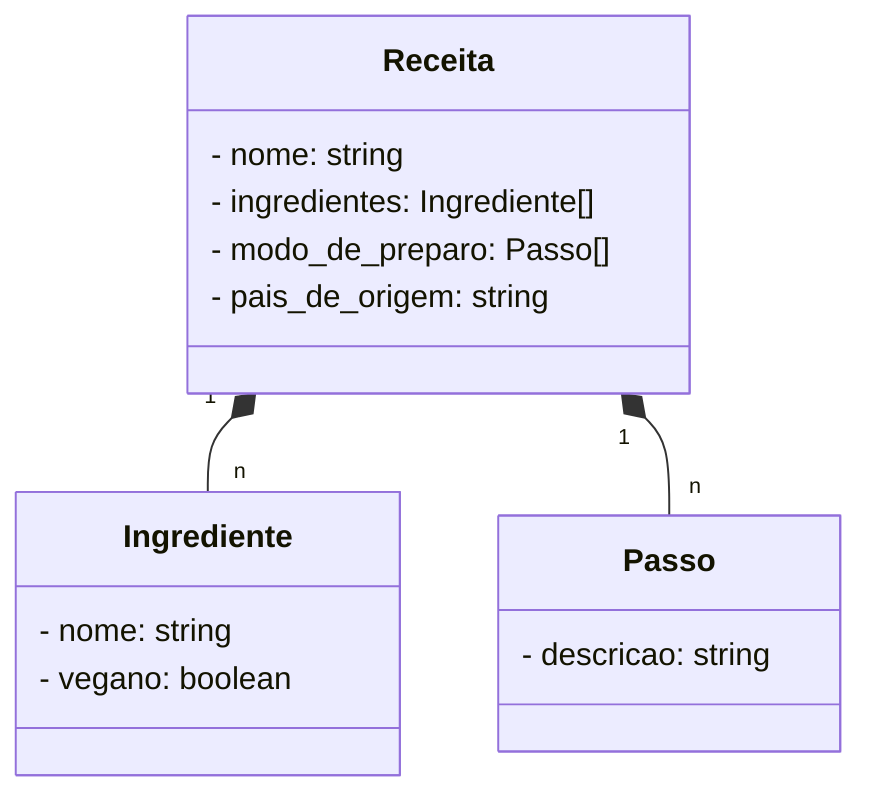

# REST API Receitas

```mermaid
classDiagram
class Receita {
  - nome: string
  - ingredientes: Ingrediente[]
  - modo_de_preparo: Passo[]
  - pais_de_origem: string
}
class Ingrediente {
  - nome: string
  - vegano: boolean
}

class Passo {
  - descricao: string
}

Receita "1" *-- "n" Ingrediente
Receita "1" *-- "n" Passo
```
